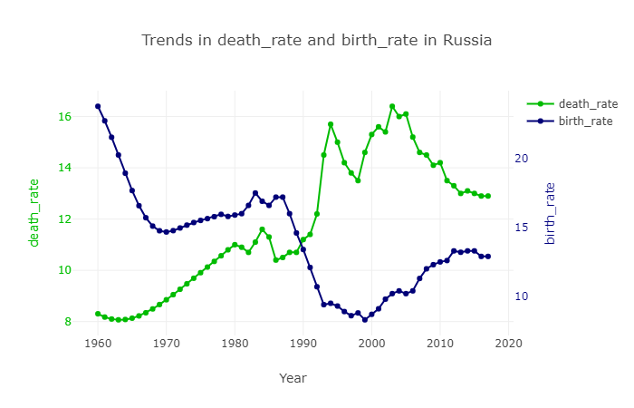

# The Right to Health Care for All

# Inspiration
  Health care is a fundamental human right. However, government policies do not reflect that. People in the United States are not guaranteed basic human needs such as clean water, food, housing, sanitation, due to our current health care system. Other countries around the world provide univeral health care for their population. How do the health care systems in other countries compare to the health care system in the United States?  How do differences in health care policies affect health outcomes?

# Data Sources
- Global Health Observatory data repository from World Health Organization (2012 - 2018)
  (http://apps.who.int/gho/data/node.imr)
- Percentage of the population covered by health insurance (members of health insurance or free access to health care services provided by the State) (1996-2011)
  (http://apps.who.int/medicinedocs/en/d/Js21558en/)
- Health Insurance Coverage by Type of Plan (1987-2014)
  (http://apps.who.int/medicinedocs/en/d/Js21558en/)
- Mortality rate, infant (per 1,000 live births)
  (https://data.worldbank.org/indicator/SP.DYN.IMRT.IN)
- Health Indicators 
  (https://data.worldbank.org/indicator)
- InfantMortalityRate_Contries 
  (https://data.worldbank.org/indicator/SP.DYN.IMRT.IN)
	Deleted null data and regions just leaving year by year data for individual countries
- Corruption Data Source 
  (https://datahub.io/core/corruption-perceptions-index)
	Raw data, not modified
- Death rate, crude (per 1,000 people) 
  (https://data.worldbank.org/indicator/SP.DYN.CDRT.IN?view=chart)
- Life expectancy at birth, total (years) 
  (https://data.worldbank.org/indicator/SP.DYN.LE00.IN?view=chart)
- Life expectancy at birth, male (years) 
  (https://data.worldbank.org/indicator/SP.DYN.LE00.MA.IN)
- Current health expenditure (% of GDP)
  (https://data.worldbank.org/indicator/SH.XPD.CHEX.GD.ZS)
- Current health expenditure per capita (current US$)- 
  (https://data.worldbank.org/indicator/SH.XPD.CHEX.PC.CD)

# Indicators
- Infant mortality rate (0-1 year) 
- Health Care Coverage (Worldwide) 
- Health expenditure 
- Basic sanitation services 
- Life Expectancy
- Corruption Index
- Death Rate

# Visuals

 

 

 
 
 
 
 
 
 # App Design

Client Side:

 -- "Landing page" contains static visualizations (Plotly?) and links to data
 explorer tools.  The page showcases the most interesting findings (about 4)
 designed to draw the user in and get them to explore the tools.  Also keeps
 the server interaction limited only to people who click through, and keeps
 some content visible even if server routes are having issues.

 -- "Data compare page" lets user compare two (maybe more) countries data 
 profiles.  Uses d3-geo to draw a clickable map, and d3 to create a 
 chart with data over time.  Uses API call to fetch geo-data.

 -- "Geo-explorer" page uses gloal projection to make a 3-D, interactive
 data display that the user can interact with spatially.  

 Server side:
 -- Jupyter based pipeline does ETL to gather data and load it into database
 -- Flask app handles access to database through server URL routes called 
 by the client base don user choices:
 Preliminary routes:  <country code> -- JSON object with timeseries data
   globe/<data>/<year> -- JSON objects meant for the 3-D interactive demo
   Will use WebGL Globe (based on THREE.js) or other library

Client side files:
/static
    / css
       --styles.css
    /js
        --compare.js
        --globe.js
    /images ? 
/templates
   -- index.html
   -- compare.html
   -- globe.html
   -- about.html

 
# GibHub Repository
https://github.com/dcalara/right-to-healthcare.git

herokuapp link
http://healthcare-rights.herokuapp.com/
